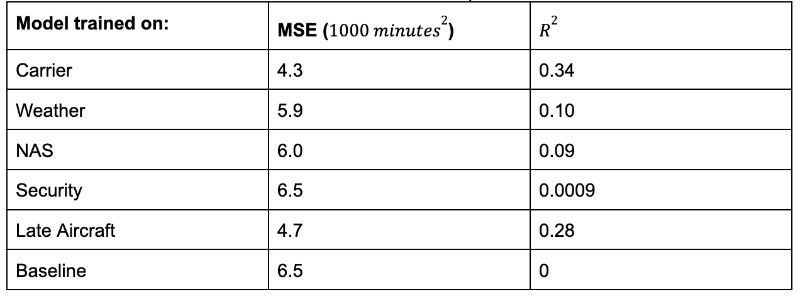
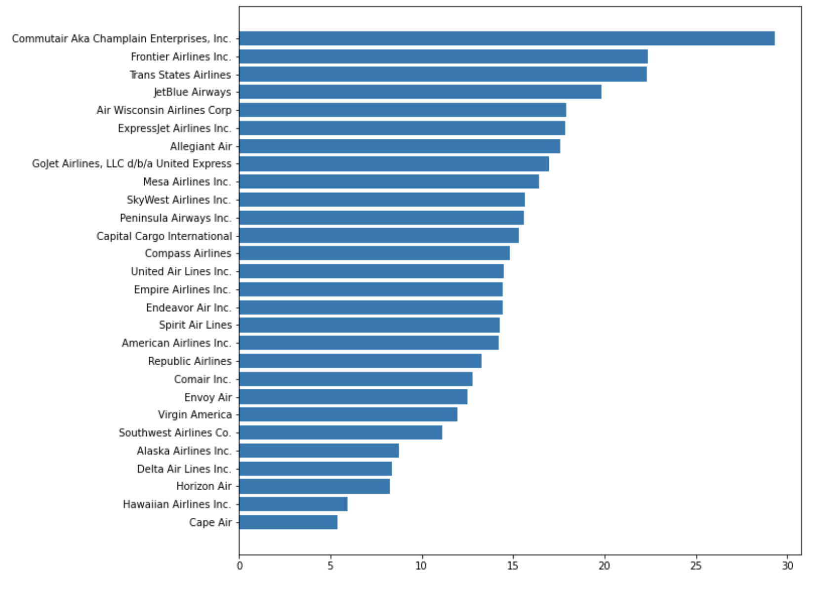

# Flight Delay Prediction Project

## Group Members
- Neha Karna (nak28)
- Maille Sherry (mm136)
- Prince Ahmed (pa99)
- Sophia Maupin (sam199)

## Introduction
Flight delays and cancellations have significant impacts on both travelers and airlines. This project focuses on predicting flight delay lengths and understanding the factors contributing to these delays. We aim to provide insights into the most influential factors and explore the differences in delay lengths during the holiday season.

## Data Sources
We utilized two datasets: 
1. **Kaggle Dataset:** Flight information from 2018-2022 with 5 million entries and 61 variables per flight.
2. **Bureau of Transportation Statistics Database:** Detailed delay data including carrier delays, weather delays, national security delays, security delays, and late aircraft delays.

## Modules Used
- **Module 4:** Data cleaning, addressing NaN values in datasets.
- **Module 5:** Constructing confidence intervals to compare mean delay times.
- **Module 8:** Creating informative visualizations to understand and analyze data.
- **Module 9:** Building prediction models (Linear Regression, Logistic Regression, KNN) to determine significant factors in predicting flight delays.

## Results and Methods

### Primary Question: Predictive Factors
- Visualizations highlighted late aircraft and carrier as significant contributors to flight delays.
- We built a Linear Regression model for each delay cause to predict delay length.
- Linear Regression models trained on carrier data showed the lowest MSE, indicating carrier's predictive power.

### Sub Question: Holiday Effect
- Hypothesis testing revealed a significant difference in delay times between holiday and non-holiday seasons.
- P-values were remarkably low, possibly due to the large dataset.

## Limitations and Future Work
- Limited generalizability due to focus on U.S. flights in 2018.
- Pandemic impact and international flights should be considered.
- Further investigation into nuanced causes of delay and pre/post-pandemic comparisons is needed.

## Conclusion
The project aimed to predict flight delay lengths and understand delay factors. Visualizations and regression models provided insights, although results were slightly contradictory. Carrier delay emerged as a significant predictor according to the models, but late aircraft delay was dominant in visualizations. Additionally, holiday season delay differences were confirmed through hypothesis testing. Future work could focus on more representative datasets and explore nuanced delay causes.
